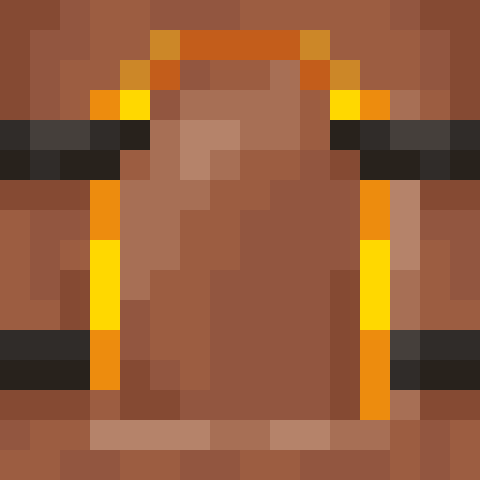

# Kiln

[>> Downloads <<](https://github.com/Boundarybreaker/Kiln/releases)

*Let's get fired up!*

**This mod is open source and under a permissive license.** As such, it can be included in any modpack on any platform without prior permission. We appreciate hearing about people using our mods, but you do not need to ask to use them. See the [LICENSE file](LICENSE) for more details.

Kiln adds a new type of furnace that smelts recipes that can't be made in vanilla blast furnaces or smokers. These include:

- Brick from clay ball
- Charcoal from logs that burn
- Cracked nether brick from nether brick
- Cracked stone brick from stone brick
- Glass from sand
- Glazed terracotta from dyed terracotta
- Green dye from cactus
- Lime dye from sea pickle
- Nether brick from netherrack
- Popped chorus fruit from chorus fruit
- Smooth quartz from quartz block
- Smooth red sandstone from red sandstone
- Smooth sandstone from sandstone
- Smooth stone from stone
- Sponge from wet sponge
- Stone from cobblestone
- Terracotta from clay

This mod was made as a redeem for BluKat on Twitch. If you want to request a mod of your own, go check me out on twitch at [LemmaEOF](https://twitch.tv/LemmaEOF)! I stream Saturday, Sunday, and Monday evenings from 7 PM to 9 PM PST.